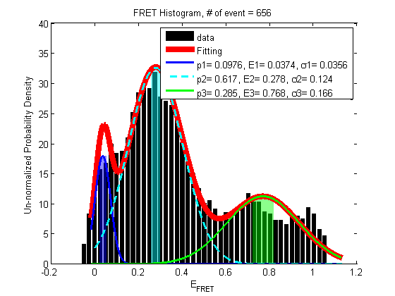

# APBS.jl
All Photon Burst Search of smFRET measurements

### The donor and acceptor channels

The donor and acceptor channel readouts from the correlator (top) and FRET (bottom). 

### The FRET histogram

### Notes 

1. The Julia functions were developed in Julia v0.6.4 and are not currently compatible to later versions.

2. Not going to maintain this. 

Yen 3/9/2020
